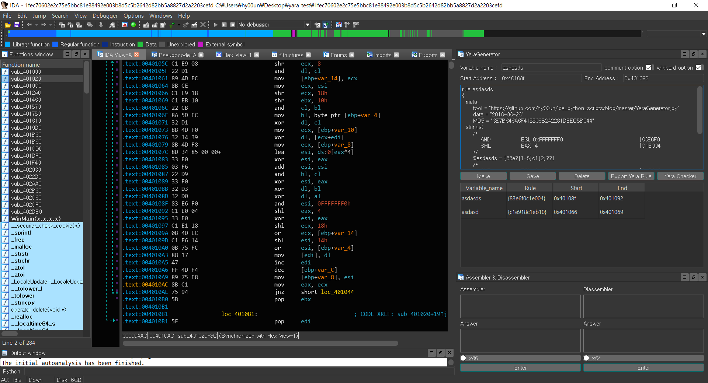
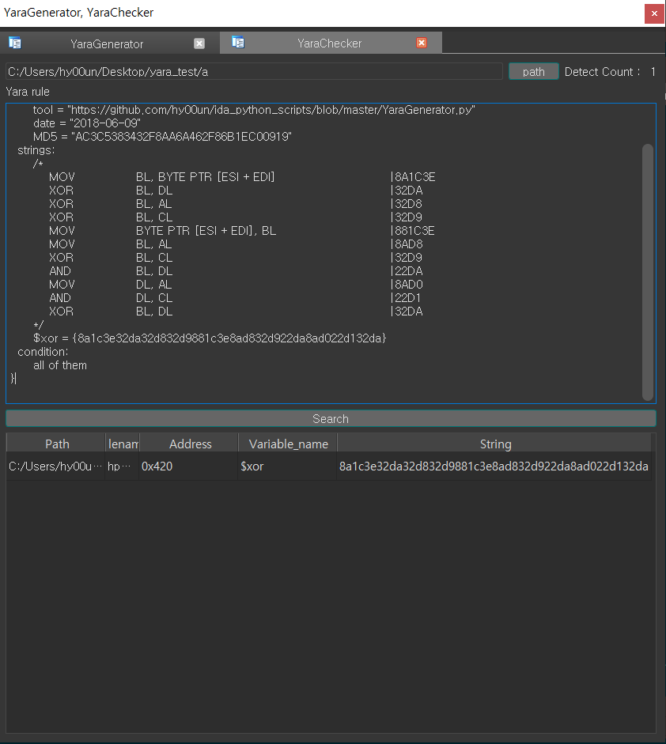
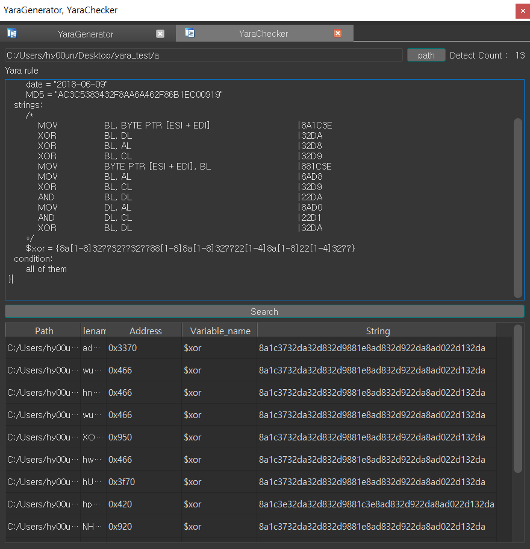
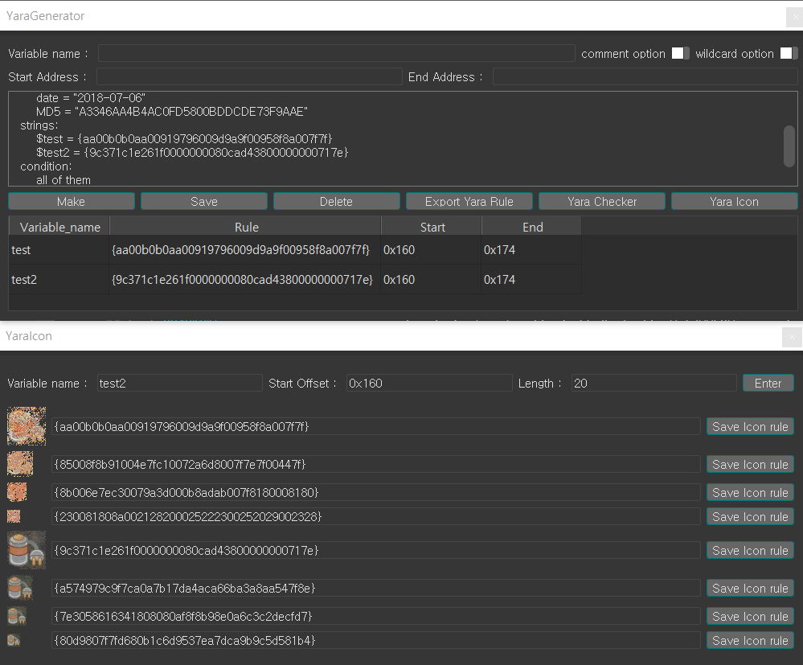
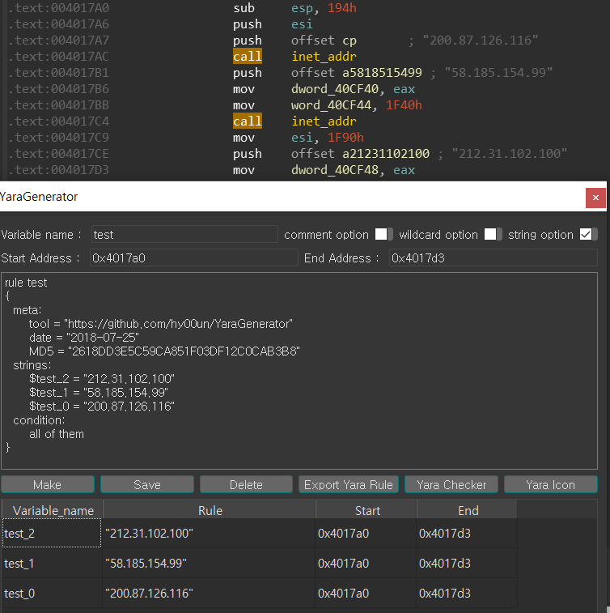
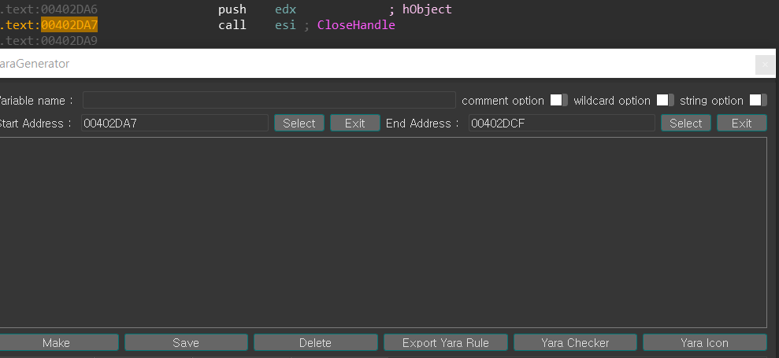
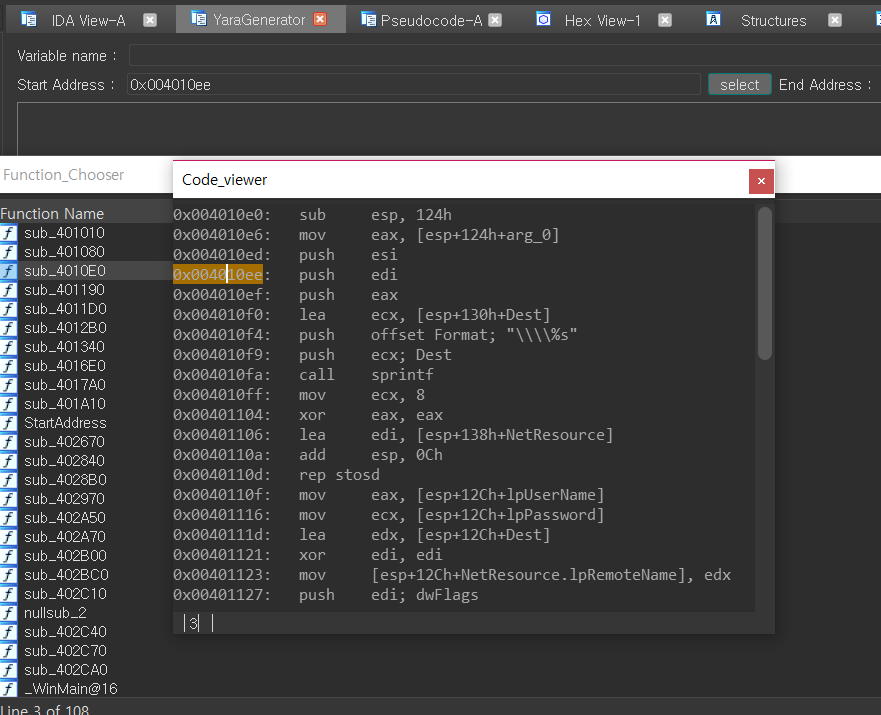

## YaraGenerator (IDA Plugin)

YaraGenerator is a tool to help you make yara rule in IDA.

If you enter an address, the assembly of that address is created as a Yara rule.

Complete automation is due to the existence of false positives.

The wildcard feature is currently under study.

### [ YaraGenerator ]

### [ YaraChecker ]

### [ YaraIcon ]

### [ string option ]
* Check .text section

### [ select option ]

## old_version/YaraGenerator_Using_simplecustviewer_Choose.py

### Install & Tutorial

pip install yara-python

pip install capstone or download module installer (https://www.capstone-engine.org/download.html)

pip install keystone-engine or download module installer (http://www.keystone-engine.org/download/)

pip install pefile

pip install pillow

copy YaraGenerator.py C:\Program Files\IDA 7.0\plugins

copy assembler_disassembler.py C:\Program Files\IDA 7.0\plugins

YaraGenerator HOT-KEY : Ctrl + Shift + Y

assembler_disassembler HOT-KEY: Ctrl + Shift + A

### TODO
* string option 사용 시 unicode일 경우 다르게 처리
* 와일드 카드 처리 정교화

