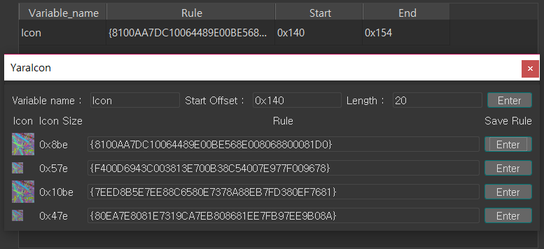
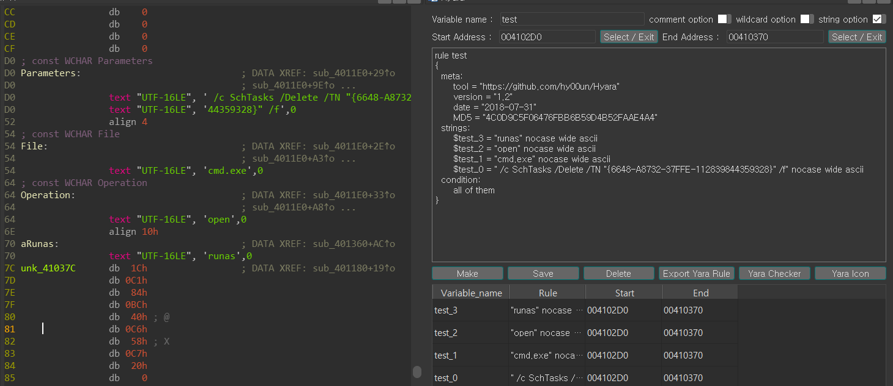
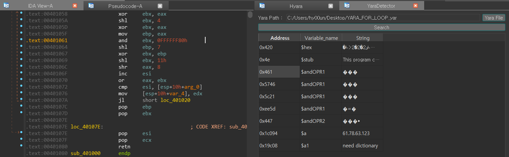
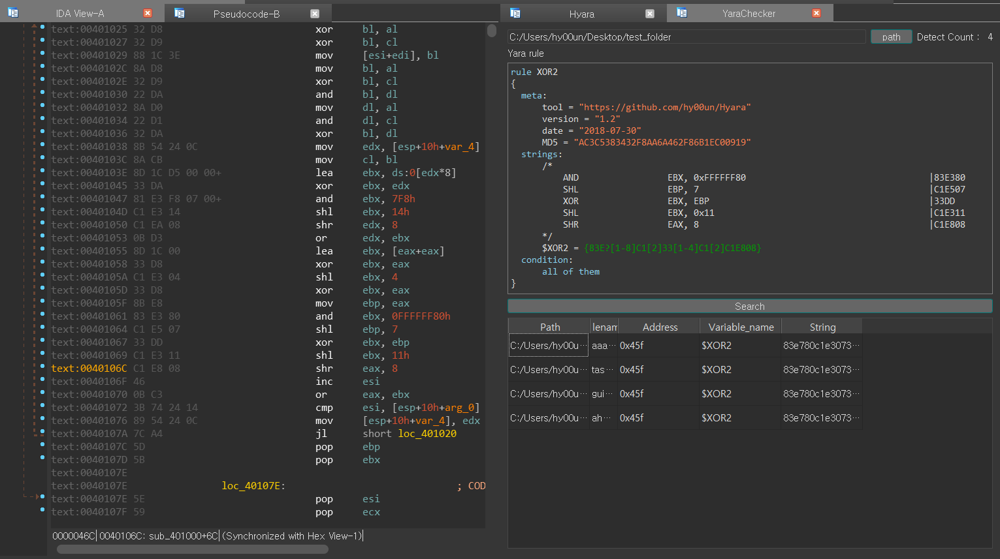
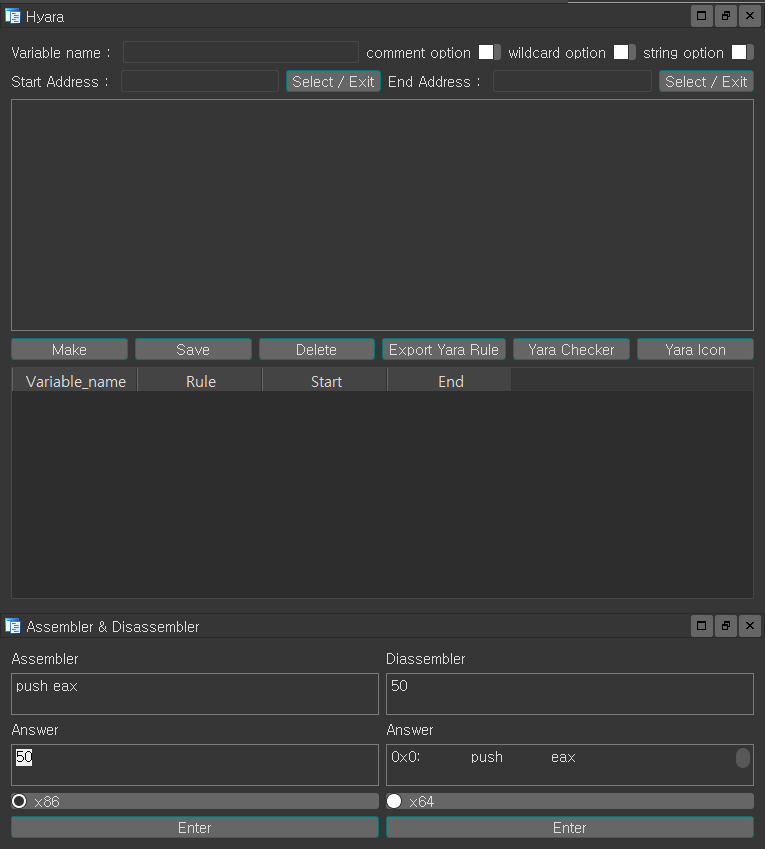
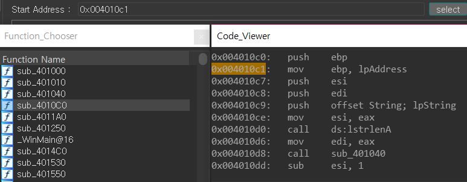
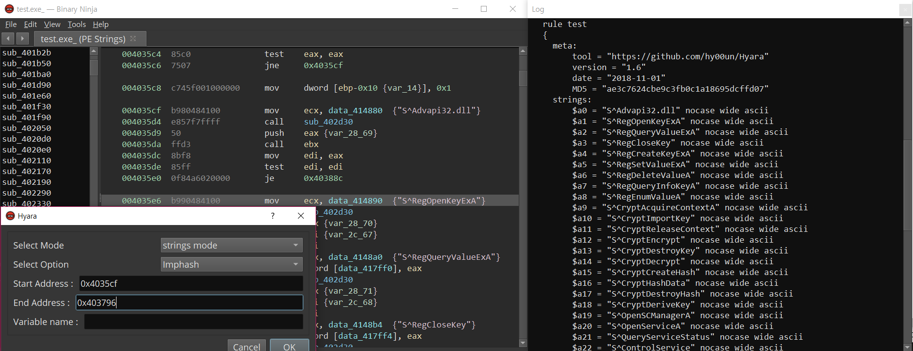

# Hyara (IDA Plugin)
Hyara is IDA Plugin that provides convenience when writing yararule.

You can designate the start and end addresses to automatically create rules.

It is created based on GUI, and adding features and improvements are currently underway.

Support for Ghidra, Cutter and Binary Ninja are in development.

## DEMO

<a href="https://youtu.be/zgL4BkQJZ-w">Youtube Link</a>

## Test Environment

IDA Pro 6.8 ~ 7.0

Python 2.7.13

capstone 3.0.5rc2

keystone 0.9.1

yara-python 3.8.1

pefile 2017.11.5

Pillow 5.2.0

## Installation

$ pip install -r requirements.txt

(if error occurs during the installation of capstone or keystone, go to the installation page for each libarary and use the installation files)

(https://www.capstone-engine.org/download.html)

(http://www.keystone-engine.org/download/)

copy Hyara.py to (IDA Pro installation directory)/plugins

copy assembler_disassembler.py to (IDA Pro installation directory)/plugins

## Hotkeys
Hyara: Ctrl + Shift + Y

assembler_disassembler: Ctrl + Shift + A

## Features
### Hyara start screen and 5 options
- When you run Hyara, it aligns to the right like the above picture and the output window is aligned to the left.
- Select/Exit button uses IDAViewWrapper api to get the clicked address in IDA View. After done, you have to press it again to finish.
- After specifying the address, press the "Make" button to show the specified hexadecimal or strings as a result.
- When you click "Save", those results will be saved in the table below.
- Press "Export Yara Rule" to finally create the yararule using variables stored in the privious step.
- The comment option on the upper right side annotates the assemblies nicely.
- There are also options to create rich header and imphash.
- If you double-click the table, you can clear the rule.
- The wildcard option works but further development is still on going.

### String option
- This option is to extract strings within the range user specified.

### YaraChecker
- You can test the yararule you write on the fly.
- It has general option and recursive option.
- It also provides table alignment.

### YaraDetector
- YaraDetector shows which part is detected in the sample loaded to IDA, and when "Address" is clicked, it moves to the corresponding address on the IDA View.

### YaraIcon
- "YaraIcon" provides the convenience when you write the rule with Icon.

### assem_disassembler
- When creating rules, be sure to check how the assembly changes when you use wildcards.
- Normally people uses website to convert assembly but you can check it by using this feature.

### Description of "old_version"
- (old_version/Hyara_Using_simplecustviewer_Choose.py)
- This version uses Choose and simplecustviewer.

## Binary Ninja
- The Binary ninja plugin made the tool simple.
- I will make it elaborate using PyQt5 in the future.

## Special Thanks
- <a href="https://twitter.com/kjkwak12">kjkwak12</a>