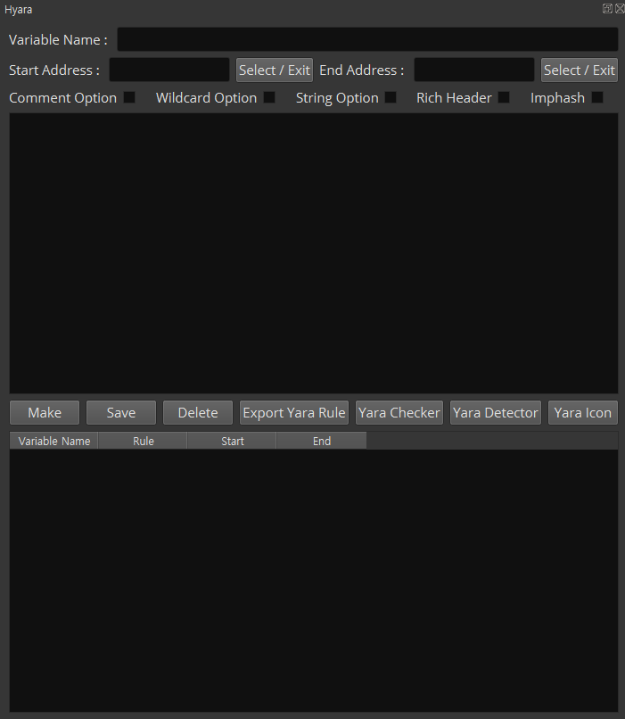
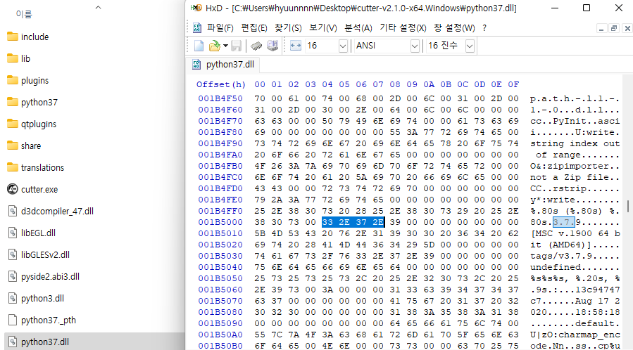

# Hyara
Hyara is Plugin that provides convenience when writing yararule.

You can designate the start and end addresses to automatically create rules.

It is created based on GUI, and adding features and improvements are currently underway.

IDA Pro and Cutter are supported.

YaraChecker, YaraDetector and YaraIcon are being developed using the code of the previous project.

## DEMO

<a href="https://youtu.be/zgL4BkQJZ-w">Youtube Link</a>

## Installation

$ pip install -r requirements.txt

copy ``Hyara_IDA.py and hyara_lib folder`` to (IDA Pro installation directory)/plugins

copy ``__init__.py, Hyara_Cutter.py and hyara_lib folder`` to (Cutter Plugin directory)/python

copy ``Hyara_BinaryNinja.py and hyara_lib folder`` to BinaryNinja Plugin directory

## Hotkeys
Hyara: Ctrl + Shift + Y (Just IDA Pro)

## Features
### Hyara start screen and 5 options
- When you run Hyara, it aligns to the right like the above picture and the output window is aligned to the left.
- Select/Exit button uses IDAViewWrapper api to get the clicked address in IDA View. After done, you have to press it again to finish.
- After specifying the address, press the "Make" button to show the specified hexadecimal or strings as a result.
- When you click "Save", those results will be saved in the table below.
- Press "Export Yara Rule" to finally create the yararule using variables stored in the privious step.
- The comment option on the upper right side annotates the assemblies nicely.
- There are also options to create rich header and imphash.
- If you double-click the table, you can clear the rule.
- The wildcard option works but further development is still on going.

### String option
- This option is to extract strings within the range user specified.

### YaraChecker
- You can test the yararule you write on the fly.
- It has general option and recursive option.
- It also provides table alignment.

### YaraDetector
- YaraDetector shows which part is detected in the sample loaded to IDA, and when "Address" is clicked, it moves to the corresponding address on the IDA View.

### YaraIcon
- "YaraIcon" provides the convenience when you write the rule with Icon.

## Binary Ninja

## Cutter

## Special Thanks
- <a href="https://twitter.com/kjkwak12">kjkwak12</a>