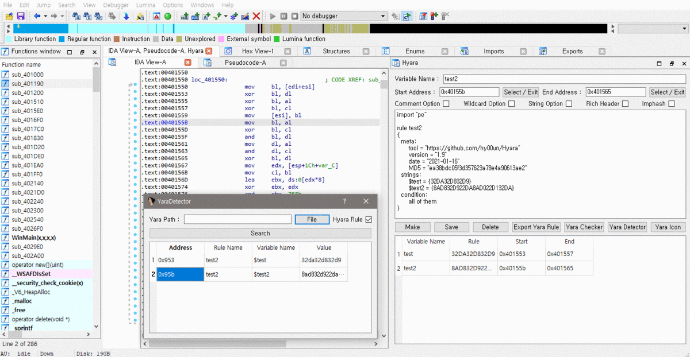
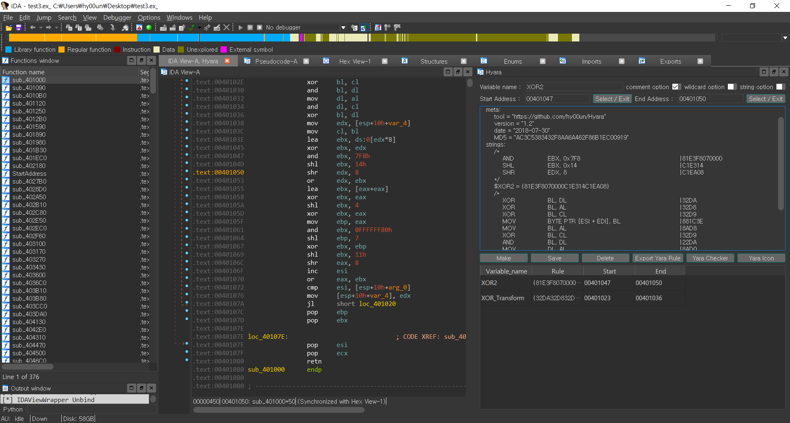
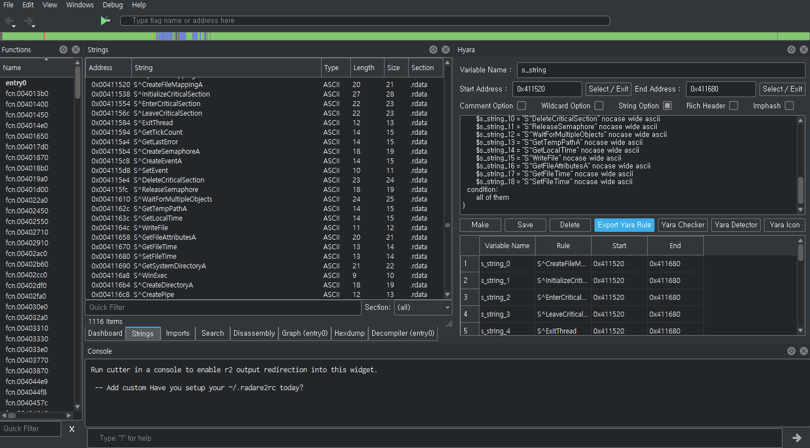
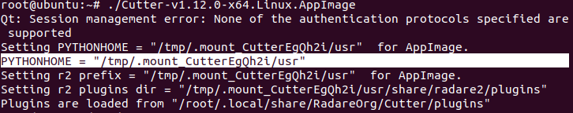
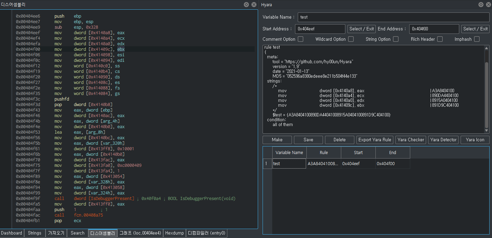
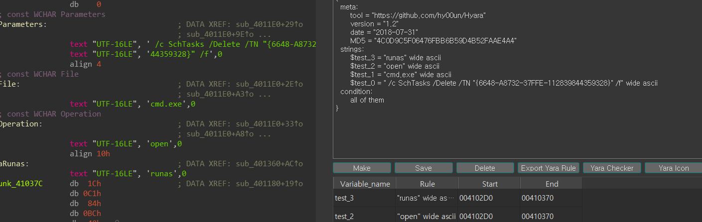

# Hyara




> Hyara is plugin that provides convenience when writing yararule.
> 
> The plugin is currently undergoing a major revision!

- [Demo video](https://youtu.be/zgL4BkQJZ-w)

## Instructions

### Start Screen and Options

- When you run Hyara, it docks itself to the right and docks the output window to the left.
- After specifying the address, press the `Make` button to show the specified hexadecimal or strings as a result.
- The results are saved in the table below when you click `Save`.
- If you double-click the table, you can clear the rule.
- `Export Yara Rule`
  - Exports the previously created yara rules.


- `Comment Option`
  - Annotates the instructions next to the condition rule(s).
- `Rich Header` and `imphash`
  - Adds rich header and imphash matching to the rule.
- `String option`
  - This option extracts strings within the range specified.




## Installation

### IDA Pro & BinaryNinja

```bash
pip install -r requirements.txt
```
- IDA Pro
  - copy ``Hyara_IDA.py and hyara_lib folder`` to $ida_dir/plugins
  - Activate via Edit -> Plugins -> Hyara (or CTRL+SHIFT+Y)
- BinaryNinja
  - copy ``Hyara_BinaryNinja.py and hyara_lib folder`` to BinaryNinja Plugin directory
  - Activate via View -> Show Hyara

### Cutter

### Windows
```bash
python3 -m pip install -I -t $cutter_dir/$cutter_python_version/site-packages -r requirements.txt
```

### Linux



```bash
mv /tmp/.mount_CutterEgQh2i/usr .
pip3 install -I -t usr/lib/python3.6/site-packages/ -r /root/Hyara/requirements.txt
./Cutter-v1.12.0-x64.Linux.AppImage --pythonhome /root/usr
```

copy ``__init__.py, Hyara_Cutter.py and hyara_lib folder`` to $cutter_plugin_dir/python/Hyara

Activate via Windows -> Plugins -> Hyara



## Features

- GUI-based
- Supports BinaryNinja, Cutter, and IDA
- YaraChecker
  - Tests the yararule on the fly
  - 
- YaraDetector
  - Shows which part is detected in the sample loaded to disassembler, and when "Address" is clicked, it moves to the corresponding address on the disassembler view.
  - 
- YaraIcon
  - Creates yara rules for icon resources embedded in the PE.
  - 

## Author

👤 **hyuunnn**

* Github: [@hyuunnn](https://github.com/hyuunnn)

### Special Thanks

* Twitter: <a href="https://twitter.com/kjkwak12">kjkwak12</a>
